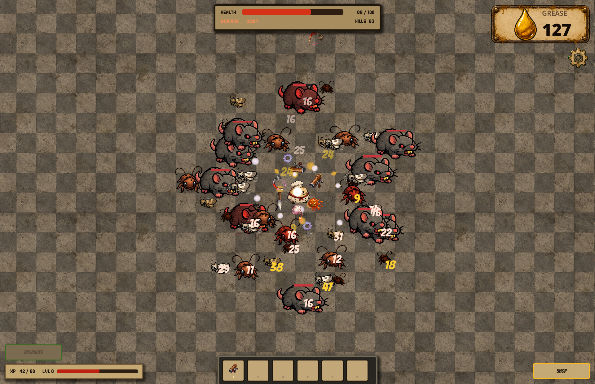

# Kitchen Madness

A top-down arena survivor roguelite built in **Godot 4** with **GDScript**. Survive a 10-minute kitchen onslaught, level up for upgrades, spend Grease in the on-demand shop, and outlast the madness.

Genre kin to games like [Brotato](https://store.steampowered.com/app/1942280/Brotato/) - original project, own art and mechanics, targeting eventual cross-platform / Steam release.

**Current status:** Phase 8C complete (10-minute survival level, scattered-swarm spawning, 6-slot loadout, on-demand shop, banked level-up upgrades). See [progress.md](progress.md) and [context.md](context.md).



---

## Quick Start

1. Install [Godot 4.6+](https://godotengine.org/download).
2. Open Godot -> **Import** -> select this folder's `project.godot`.
3. Press **F5** to play.

The game starts immediately. There is no main menu yet.

---

## Controls

| Input | Action |
|---|---|
| **WASD** / **Arrow keys** | Move |
| **W/S** or **Up/Down** | Navigate level-up / shop menus |
| **1-3** / **Enter** | Pick level-up upgrade |
| **1-8** / **Enter** | Buy in shop, Enter to continue |
| **R** or **Restart** | Restart after Game Over |

---

## Docs

- [Setup](docs/setup.md) - install Godot, configure Cursor, and run the game
- [Development workflow](docs/development-workflow.md) - checks, tests, screenshot captures, and hooks
- [Project layout](docs/project-layout.md) - folder structure and version-control notes
- [Adding visuals](docs/adding-visuals.md) - replace placeholder art with sprites
- [All docs](docs/README.md)

---

## Development Commands

```powershell
.\tools\codecheck.ps1
.\tools\capture-visuals.ps1
```

Visual screenshots are committed under `visual-tests/screenshots/` when they represent useful progress snapshots.

---

## Roadmap

See [plans.md](plans.md) for the full development plan. Wave scaling and the art pass are next.

---

## License

Not set yet — solo indie project.
