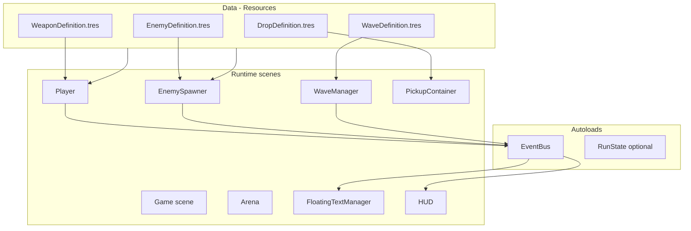

# Development plan: Phase 2 and beyond

A roadmap grounded in the Phase 1 prototype — flat scripts, one enemy, one gun, direct UI wiring, and `game.gd` doing too much. The goal is to grow content (enemies, guns, drops, maps) without the codebase turning into spaghetti.

See also: [context.md](context.md) for iteration rules and current project state.

---

## North star

**Data-driven content, thin scenes, testable logic.**

Designers (future you) add enemies/weapons/drops by creating `.tres` resources and scenes — not by editing core game code. Agents and CI can run `codecheck` before every handoff. Every iteration ends with zero parser errors and passing tests.

---

## Current pain points (what to fix first)

| Issue | Where | Risk as content grows |
|---|---|---|
| God object | `game.gd` owns wave, spawn, UI, arena, kills | Every new feature touches one file |
| Hard-coded stats | `player.gd`, `enemy.gd`, weapon constants | 50 enemies = 50 copy-paste scripts |
| Single enemy export | `game.tscn` → one `enemy_scene` | No spawn tables or wave variety |
| Brittle node paths | `get_tree().current_scene.get_node("ProjectileContainer")` | Breaks when scene tree changes |
| Duplicated arena logic | bounds copied in player, enemy, projectile, weapon | Map changes require 6+ edits |
| Direct UI calls | `player.health_changed → ui.update_health` | UI can't react to drops, XP, damage numbers |
| No test harness | manual F5 only | Regressions slip through vibe-coding |

---

## Target architecture



### Core patterns

1. **Resource definitions** — stats live in `.tres`, not in logic scripts
2. **Base classes + overrides** — one `base_enemy.gd`, variants only change behavior
3. **Event bus** — `"damage_dealt"`, `"enemy_died"`, `"xp_gained"` decouple gameplay from UI
4. **Composition over inheritance for weapons** — `WeaponController` holds N weapon instances
5. **Spawner reads wave tables** — weighted enemy picks, not a single `PackedScene` export

---

## Proposed folder structure

```
brotato-clone/
├── context.md
├── plans.md
├── project.godot
├── tools/
│   ├── codecheck.ps1          # Windows entry point
│   ├── codecheck.sh           # macOS/Linux entry point
│   └── run_tests.gd           # Headless test runner
├── tests/
│   ├── unit/
│   │   ├── test_wave_manager.gd
│   │   ├── test_xp_system.gd
│   │   └── test_spawn_table.gd
│   └── integration/
│       └── test_game_boot.gd
├── resources/
│   ├── enemies/
│   │   ├── chaser.tres
│   │   ├── tank.tres
│   │   └── sprinter.tres
│   ├── weapons/
│   │   ├── pistol.tres
│   │   ├── shotgun.tres
│   │   └── orbit_blade.tres
│   ├── drops/
│   │   ├── xp_orb_small.tres
│   │   └── health_pickup.tres
│   └── waves/
│       └── wave_01.tres
├── scripts/
│   ├── autoload/
│   │   └── event_bus.gd
│   ├── data/
│   │   ├── enemy_definition.gd
│   │   ├── weapon_definition.gd
│   │   ├── drop_definition.gd
│   │   └── wave_definition.gd
│   ├── components/
│   │   ├── health_component.gd
│   │   ├── hurtbox.gd
│   │   └── arena_clamp.gd
│   ├── enemies/
│   │   ├── base_enemy.gd
│   │   ├── chaser_enemy.gd
│   │   └── tank_enemy.gd
│   ├── weapons/
│   │   ├── weapon_controller.gd
│   │   ├── base_weapon.gd
│   │   ├── projectile_weapon.gd
│   │   └── orbit_weapon.gd
│   ├── pickups/
│   │   ├── base_pickup.gd
│   │   └── xp_orb.gd
│   ├── systems/
│   │   ├── wave_manager.gd
│   │   ├── enemy_spawner.gd
│   │   └── xp_system.gd
│   ├── ui/
│   │   ├── hud.gd
│   │   ├── floating_text.gd
│   │   └── floating_text_manager.gd
│   └── utils/
│       └── math_utils.gd
└── scenes/
    ├── main/game.tscn
    ├── arena/arena.tscn
    ├── player/player.tscn
    ├── enemies/...
    ├── weapons/...
    ├── pickups/...
    └── ui/...
```

Migrate incrementally — keep Phase 1 working while refactoring.

---

## Phased roadmap

### Phase 2A — Foundation refactor (do this before content explosion)

**Goal:** Structure that supports many enemies/guns without rewriting `game.gd` every time.

| Task | Details |
|---|---|
| **EventBus autoload** | Signals: `damage_dealt(world_pos, amount, is_crit)`, `enemy_killed(enemy, killer)`, `player_health_changed(cur, max)`, `xp_changed(cur, to_next, level)`, `pickup_collected(type)` |
| **HealthComponent** | Shared HP, i-frames, `take_damage()`, death signal — used by player and enemies |
| **Arena as scene** | `arena.tscn` owns bounds, walls, background; exposes `get_bounds(): Rect2` |
| **Split `game.gd`** | `WaveManager` (timer, win/lose), `EnemySpawner` (spawn logic, cap, edge positions) |
| **WeaponController** | Node on player; add/remove weapons from `WeaponDefinition` resources |
| **Resource types** | `EnemyDefinition`, `WeaponDefinition`, `DropDefinition`, `WaveDefinition` as `Resource` scripts |

**Definition of done:** Phase 1 gameplay still works; no behavior change visible to player; `codecheck` passes.

---

### Phase 2B — Enemies, guns, drops

#### Enemies (start with 3 archetypes)

| Type | Stats | Behavior | Visual (placeholder) |
|---|---|---|---|
| **Chaser** (current) | 30 HP, 90 speed | Straight chase | Red circle, r=12 |
| **Tank** | 80 HP, 45 speed | Chase, higher contact dmg | Dark red, r=18 |
| **Sprinter** | 15 HP, 160 speed | Chase, slight zigzag or burst | Orange, r=9 |

**Implementation:**

- `base_enemy.gd` reads `EnemyDefinition` in `_ready()`, applies stats to `HealthComponent`
- Subclass or `@export var behavior: Script` only when behavior truly differs
- `EnemySpawner` picks from weighted table in `WaveDefinition`:

```gdscript
# wave_definition.gd (Resource)
@export var duration: float = 30.0
@export var spawn_interval: float = 1.2
@export var max_enemies: int = 40
@export var enemy_weights: Array[EnemySpawnEntry]  # { definition, weight }
```

#### Guns (start with 3 weapons)

| Weapon | Style | Feel |
|---|---|---|
| **Pistol** (current) | Single projectile, nearest target | Reliable baseline |
| **Shotgun** | 5 pellets, spread, short range | Crowd clear |
| **Orbit blade** | 2 blades rotate around player | Melee-ish, no aiming |

**Implementation:**

- `BaseWeapon.gd`: `fire(delta)`, `cooldown`, reads `WeaponDefinition`
- `WeaponDefinition.tres`: damage, fire_rate, projectile_scene, spread, count, range
- Player starts with pistol; pickups or wave rewards add more via `WeaponController.add_weapon(def)`

#### Drops

| Drop | On collect | Spawn rule |
|---|---|---|
| **XP orb (small)** | +5 XP | 100% from normal enemies |
| **XP orb (large)** | +20 XP | Tank enemies only |
| **Health pickup** | +15 HP | 5% random drop |

**Implementation:**

- `base_pickup.gd` — Area2D, magnet toward player when close, `collect(player)`
- Enemy emits `enemy_killed` → spawner or loot system spawns drops at position
- `DropDefinition.tres`: scene, value, magnet radius, color

---

### Phase 2C — UI polish

Build UI as **reactions to EventBus**, not direct calls from gameplay scripts.

| UI element | Trigger | Notes |
|---|---|---|
| **Player HP bar** | `player_health_changed` | Restyle: red fill, dark bg, smooth tween |
| **XP bar + level label** | `xp_changed`, `level_up` | Bottom of screen; flash on level-up |
| **Wave timer** | `wave_time_changed` | Keep countdown; add subtle pulse under 10s |
| **Kill counter** | `enemy_killed` | Already exists |
| **Floating damage numbers** | `damage_dealt` | Pool of `FloatingText` nodes; float up + fade |
| **Pickup feedback** | `pickup_collected` | Small "+5 XP" near player or orb position |
| **Enemy HP bars** (optional) | Only for tanks/elites | Thin bar above large enemies |

**HUD scene split:**

```
ui/
  hud.tscn           # layout only
  hud.gd             # listens to EventBus
  floating_text.tscn
  floating_text_manager.gd
  components/
    stat_bar.tscn    # reusable HP/XP bar
```

---

### Phase 2D — XP and progression loop

Minimal loop to make XP bar meaningful:

1. Kill enemy → XP orb drops → walk over it → XP fills bar
2. Bar full → pause 0.5s → level up → pick 1 of 3 upgrades (simple overlay)
3. Upgrades: +10% damage, +10% speed, +20 max HP, +1 orbit blade, etc.

Shop in Phase 3 becomes "buy upgrades for gold" using the same stat system.

---

### Phase 2E — Tests and codecheck

#### Tooling stack (Godot 4.6 friendly)

| Tool | Purpose | Install |
|---|---|---|
| **GdUnit4** or **GUT** | Unit/integration tests | Addon in `addons/` |
| **gdlint** | GDScript lint | `pip install gdtoolkit` |
| **gdformat** | Formatter | same package |
| **Godot headless** | CI / agent verification | Godot binary on PATH |

#### `codecheck` command (single entry point)

```powershell
# tools/codecheck.ps1 — run before every handoff
# 1. Format check
# 2. Lint
# 3. Headless parse (project loads, no errors)
# 4. Unit tests
# Exit non-zero on any failure
```

Concrete steps:

```powershell
# 1. Lint
gdlint scripts/ tests/

# 2. Format check (no writes)
gdformat --check scripts/ tests/

# 3. Godot headless smoke — project loads main scene
godot --headless --path . --quit-after 1

# 4. Run tests via GdUnit4/GUT
godot --headless --path . -s addons/gdUnit4/bin/GdUnitCmdTool.gd --addons -a tests/
```

Add to `context.md`:

```markdown
Before finishing an iteration, run: `./tools/codecheck.ps1` (or `.sh` on macOS)
All checks must pass. Fix failures in the same iteration.
```

#### What to test first (high value, low flake)

| Test | What it verifies |
|---|---|
| `test_wave_manager.gd` | Timer hits 0 → wave complete; stops spawning |
| `test_spawn_table.gd` | Weighted pick returns valid definitions; respects max cap |
| `test_xp_system.gd` | XP accumulates; level-up at threshold |
| `test_health_component.gd` | i-frames block double damage; death at 0 |
| `test_game_boot.gd` | Main scene instantiates without errors (integration) |

Keep tests **logic-only** where possible — test Resources and plain GDScript classes without needing full physics simulation.

#### Optional: pre-commit hook

Run `gdlint` + `gdformat --check` on staged `.gd` files only. Full test suite on CI or before PR.

---

## Suggested implementation order

Work in vertical slices — each step is playable + passes `codecheck`.

```
Week 1 — Foundation
  ├── EventBus + HealthComponent
  ├── Split game.gd → WaveManager + EnemySpawner
  ├── Arena scene + resource definitions skeleton
  └── codecheck.ps1 (smoke + lint only)

Week 2 — Content pipeline
  ├── EnemyDefinition + 3 enemy types
  ├── WaveDefinition with weighted spawns
  ├── WeaponDefinition + WeaponController
  └── Pistol migrated to data-driven

Week 3 — Combat variety
  ├── Shotgun + orbit blade weapons
  ├── XP orbs + DropDefinition
  ├── XP system + level-up picker (minimal)
  └── First unit tests

Week 4 — UI + polish
  ├── Floating damage numbers
  ├── XP bar, improved HP bar
  ├── Pickup feedback text
  └── Full test suite + codecheck in context.md
```

Adjust pace to vibe — order matters more than calendar.

---

## Data definition sketches (reference for implementation)

```gdscript
# scripts/data/enemy_definition.gd
class_name EnemyDefinition
extends Resource

@export var id: String
@export var scene: PackedScene
@export var max_health: int = 30
@export var move_speed: float = 90.0
@export var contact_damage: int = 10
@export var xp_drop: DropDefinition
@export var color: Color = Color.RED
@export var radius: float = 12.0
```

```gdscript
# scripts/data/weapon_definition.gd
class_name WeaponDefinition
extends Resource

@export var id: String
@export var weapon_script: Script          # projectile_weapon.gd, orbit_weapon.gd
@export var damage: int = 15
@export var fire_rate: float = 0.45
@export var projectile_scene: PackedScene  # null for melee/orbit
@export var pellet_count: int = 1
@export var spread_degrees: float = 0.0
```

These let you add `sprinter.tres` by duplicating a file in the editor — no new code.

---

## What to defer (Phase 3+)

- Shop between waves (reuse stat/weapon upgrade system)
- Multiple maps (Arena reads `MapDefinition` with different bounds + tile layout)
- Object pooling (when enemy count > ~80 and profiling says so)
- Save/meta progression
- Main menu, settings, Steam
- Sound (one placeholder SFX is fine when UI feels good)

---

## Definition of done (every iteration)

From [context.md](context.md), expanded:

1. **No parser/script errors** — Godot opens cleanly, F5 works
2. **`codecheck` passes** — lint, format, headless boot, tests green
3. **New content is data-driven** — adding enemy #4 = new `.tres` + optional behavior script, not editing spawner logic
4. **UI reacts via EventBus** — no new `ui.update_*()` calls from gameplay code
5. **Brief changelog** — what was added, how to try it, new controls if any

---

## Recommended next action

Start with **Phase 2A** in one focused pass:

1. Add `EventBus` autoload
2. Extract `HealthComponent`
3. Split `WaveManager` + `EnemySpawner` out of `game.gd`
4. Add `tools/codecheck.ps1` with headless smoke + gdlint

That unlocks everything else without breaking the playable loop.
